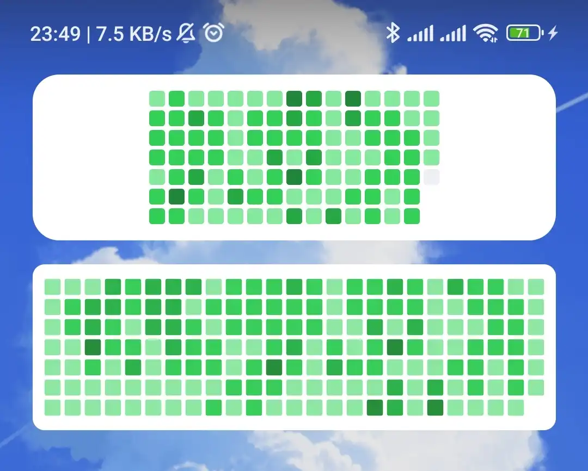

# gc


**g**ithub **c**ontribution widget for android.

## Why



- official github app widget became ugly (up: github, down: gc)
- wanted to create android app for fun

## Features

- small size (<100 KiB release binary)
- simple codebase (<500 LoC)

## Develop

```bash
# Optional: set up Android CLI for agent workflows
android init
android sdk install platform-tools platforms/android-35 build-tools/36.0.0

just debug
just release

# Install via Android CLI if available, otherwise adb
just install-debug
just install-release

# Pull fresh Android guidance for an agent task
android docs search 'app widget debugging'
```

Project-local Android agent instructions live in `.skills/gc-android-workflow/SKILL.md`.

## License

[AGPL-3.0-only](./LICENSE)
