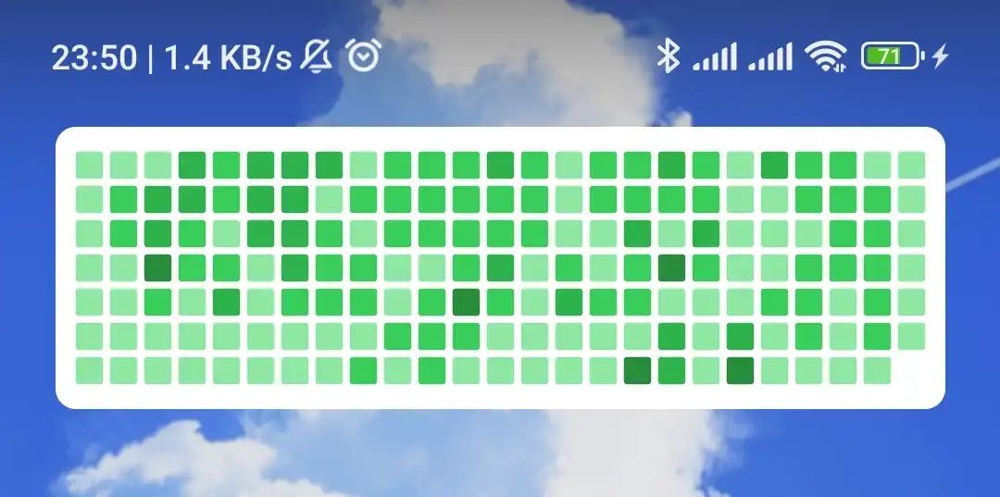
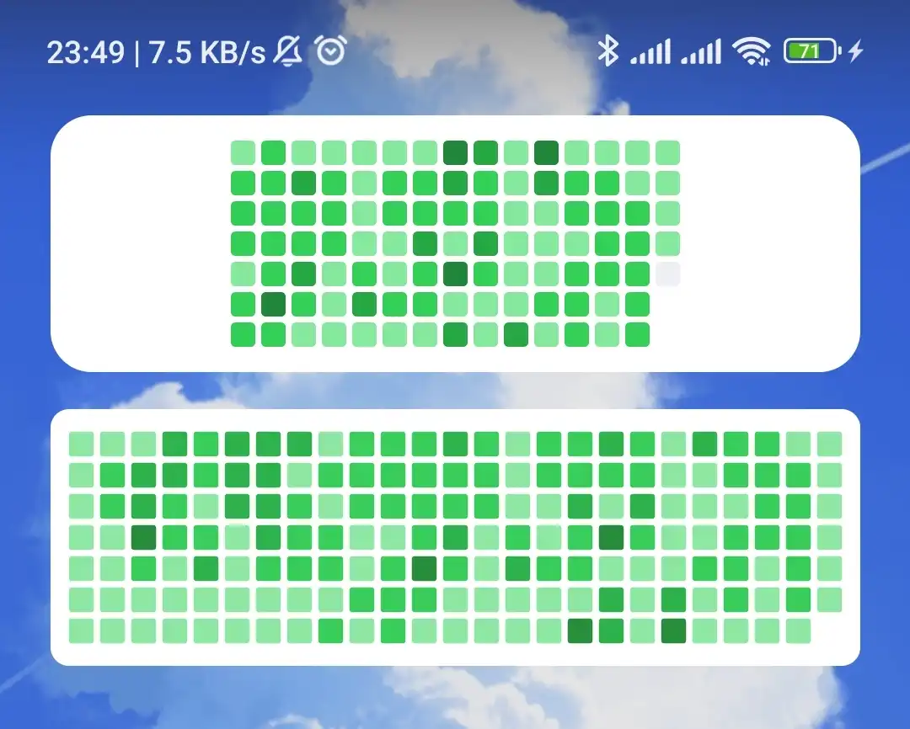

# gc

**g**ithub **c**ontribution widget for android.

## Why

- official github app widget became ugly (up: github, down: gc)
- wanted to create android app for fun

## Features

- small size (<100 KiB release binary)
- resizable home-screen widget
- configurable color schemes: GitHub light, GitHub dark, blue, and transparent background
- simple codebase (<500 LoC)

## License

[AGPL-3.0-only](./LICENSE)
